# Hybrid AI Retrieval Architecture with Long-Term AI Memory

## Executive Overview

This system implements a production-grade **Hybrid AI Retrieval Architecture** for personal finance management. Unlike basic RAG chatbots that attempt to embed raw transactions into a vector database, this architecture deliberately separates **deterministic structured financial calculations** (handled via SQL) from **long-term historical AI knowledge retrieval** (handled via vector similarity search using `pgvector`).

---

## Architecture Diagram

```mermaid
flowchart TD
    User([User Question]) --> Intent[Intent Classification Layer]
    
    Intent -->|Current State Query| SQLBranch[Structured SQL Retrieval]
    Intent -->|Historical / Trend Query| HybridBranch[Hybrid Retrieval Engine]
    
    subgraph PostgreSQL Database
        Accounts[(accounts)]
        Transactions[(transactions)]
        Budgets[(budgets)]
        AIMemories[(ai_memories - pgvector HNSW)]
    end
    
    SQLBranch --> Accounts
    SQLBranch --> Transactions
    SQLBranch --> Budgets
    
    HybridBranch --> Accounts
    HybridBranch --> Transactions
    HybridBranch --> Budgets
    HybridBranch --> VectorSearch[Vector Similarity Search]
    
    VectorSearch -->|Mandatory userId Filter| AIMemories
    
    Accounts --> PromptBuilder[Prompt Construction Layer]
    Transactions --> PromptBuilder
    Budgets --> PromptBuilder
    VectorSearch -->|Retrieved Top-K Memories| PromptBuilder
    
    PromptBuilder --> LLM[Gemini 3.6 Flash / Flash Latest]
    LLM --> Response[Final AI Response + Report Citations]
```



---

## 1. Structured SQL vs Vector RAG: Architectural Trade-Offs

### Why SQL is Used for Structured Financial Data
Structured financial records (Transactions, Accounts, Budgets, Forecast Balances) demand absolute numerical precision, strict filtering, date range boundaries, and exact mathematical aggregation. 

| Requirement | Structured SQL | Vector RAG |
| :--- | :--- | :--- |
| **Exact Balances & Totals** | 100% Deterministic (`SUM()`, `AVG()`) | Non-deterministic, prone to math errors |
| **Date & Category Filtering** | Exact (`WHERE date >= ...`) | Approximate semantic similarity |
| **Data Integrity & Consistency** | ACID Transactions | Eventual consistency, embedding lag |
| **Security & Auditing** | Row-level locking & exact audit | High-dimensional vector space blur |

**Architectural Decision:** Raw transactions, account balances, and budget constraints are **never embedded**. SQL remains the single source of truth for current financial state.

---

## 2. What Gets Embedded into Vector Database

Only **high-level, long-form AI-generated knowledge** is embedded into the vector database.

### Embedded Document Types:
1. **Monthly Financial Reports**: Generated on the 1st of every month via background jobs.
2. **AI Financial Insights**: Periodically computed spending behavior analysis.
3. **Cash Flow Forecast Summaries**: Multi-day balance projections and actionable advice.
4. **Budget Alert Explanations**: Notifications generated when a user exceeds budget targets.
5. **Historical Recommendations**: Specific advice provided to the user over time.

---

## 3. Database Schema & pgvector Integration

### Schema Definition (`prisma/schema.prisma`)
```prisma
model AIMemory {
  id           String   @id @default(uuid())
  userId       String
  user         User     @relation(fields: [userId], references: [id], onDelete: Cascade)
  documentType String   // MONTHLY_REPORT | AI_INSIGHT | FORECAST_SUMMARY | BUDGET_ALERT | RECOMMENDATION
  month        String?  // e.g. "September 2026"
  title        String
  content      String   @db.Text
  embedding    Unsupported("vector(3072)")?
  createdAt    DateTime @default(now())
  updatedAt    DateTime @updatedAt

  @@index([userId])
  @@index([documentType])
  @@map("ai_memories")
}
```

### HNSW Indexing
To ensure sub-millisecond similarity search across millions of memory records, an HNSW vector index is created on the vector column:
```sql
CREATE INDEX IF NOT EXISTS ai_memories_embedding_hnsw_idx 
ON ai_memories USING hnsw (embedding vector_cosine_ops);
```

---

## 4. Embedding Lifecycle & Auto-Pipeline

Memories are created automatically during system events via `lib/ai/advisor/memory/memory-pipeline.js`:

```
Monthly Report Cron / Budget Alert / Forecast Computation
                         │
                         ▼
        Generate Plain Text Knowledge Summary
                         │
                         ▼
       Generate Embedding (gemini-embedding-001)
                         │
                         ▼
  Store in PostgreSQL (ai_memories) with userId Filter
```

- **No Unnecessary Regeneration**: Embeddings are computed only when new reports, forecast summaries, or budget alerts are produced.
- **Idempotent Upsert**: Re-running a report for the same month replaces the existing document to avoid clutter.

---

## 5. Intent Classification & Automatic Routing

Query routing is handled automatically in `lib/ai/advisor/intent-classifier.js`:

1. **`SQL_ONLY` Queries**:
   - Examples: *"What is my balance?"*, *"Will I exceed my budget?"*, *"How much did I spend on dining this month?"*
   - Execution: Bypasses vector embedding generation entirely for minimum latency.
2. **`HYBRID_SQL_RAG` Queries**:
   - Examples: *"What advice have you been giving me repeatedly?"*, *"What mistakes have I repeated?"*, *"What did you recommend in May when I exceeded my budget?"*
   - Execution: Triggers question embedding generation, pgvector similarity search, context assembly, and Gemini completion with memory citations.

---

## 6. Prompt Construction & Citations

The prompt builder (`lib/ai/advisor/prompt-builder.js`) contextually blends:
1. **Live SQL Financial Summary**: Current total balance, month income/expense, category totals, and recent 10 transactions.
2. **Retrieved Historical RAG Memories**: Top-K relevant past reports/insights with title, document type, month, and relevance score.
3. **Citations Guideline**: Instructs Gemini to explicitly cite previous reports when answering historical trend questions.

---

## 7. Security & User Data Isolation

- **Mandatory `userId` Filter**: Every pgvector query includes `WHERE "userId" = $2`. No user can ever query another user's vector embeddings.
- **Data Protection**: Raw vector float arrays and raw distance scores are kept internal to the backend and never exposed over client APIs.
- **Authentication**: Strict Clerk authentication enforced on all server actions and services.

---

## 8. Resilience & Graceful Fallback Strategy

If the Gemini Embedding API or pgvector vector search experiences an issue:
1. The error is caught and logged gracefully.
2. The AI Advisor automatically falls back to **`SQL_ONLY` mode**.
3. The user receives a valid response based on live financial state without application downtime.

---

## 9. Future Improvements

1. **Hybrid BM25 + Vector Search (Reciprocal Rank Fusion)**: Combining full-text search with dense vector embeddings for enhanced keyword accuracy.
2. **Cross-Encoder Reranking**: Re-ranking Top-K vector candidates using a reranker model for higher precision.
3. **Memory Expiration & Summarization**: Periodically compressing multi-year monthly reports into annual financial memory summaries.
